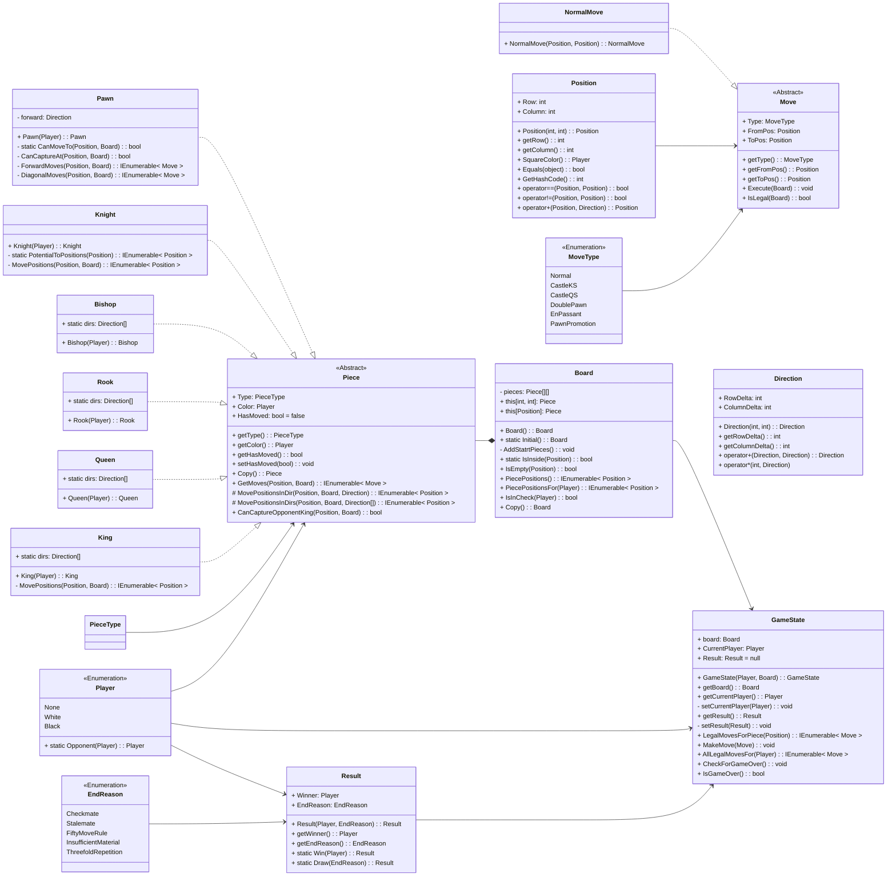

# Chess AI Solution by Tarik Merzkani

> Start Date: 9/28/2023

Credits for UI and Chess game codework obtained from code-along by OttoBotCode at the link below: 
https://www.youtube.com/playlist?list=PLFk1_lkqT8MahHPi40ON-jyo5wiqnyHsL 

## Additions in the Code Made By Myself

Board.cs {
    public static CustomInitial(String fenString)
    private void customAddPieces(String fenString)
}

## Markdown UML Diagram of the Chess Project

